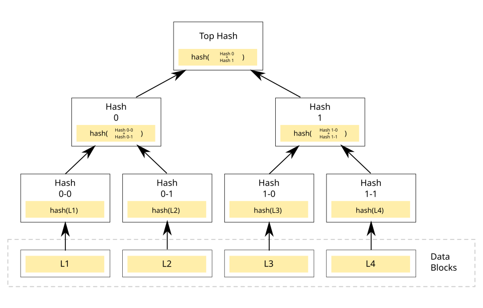

# merkle_tree_rust
An experimental implementation of a Merkle / Hash Tree using the Rust programming language.

## What is a Merkle Tree?

A Merkle Tree, often referred to as a hash tree, represents a fundamental data structure in computer science and cryptography. 

Its structure is hierarchical, resembling an inverted tree. At the base of this tree are the "leaf" nodes, each containing a cryptographic hash derived from a distinct block of data. Moving upwards, every node that is not a leaf—termed an internal node, branch, or inode—stores a cryptographic hash computed from the combined hashes of its direct child nodes.

The primary function of a Merkle Tree is to enable the efficient and secure verification of large datasets. 

By summarizing potentially vast amounts of data into a single root hash, it allows parties to confirm data integrity without transmitting the entire dataset. 

This structure serves as a more sophisticated evolution of simpler concepts like hash lists or hash chains. 

Its utility is demonstrated in numerous real-world systems requiring robust data verification, including prominent blockchains like Bitcoin and Ethereum, distributed databases such as Apache Cassandra, and version control systems like Git, primarily for ensuring data integrity and facilitating efficient synchronization between distributed copies of data.

